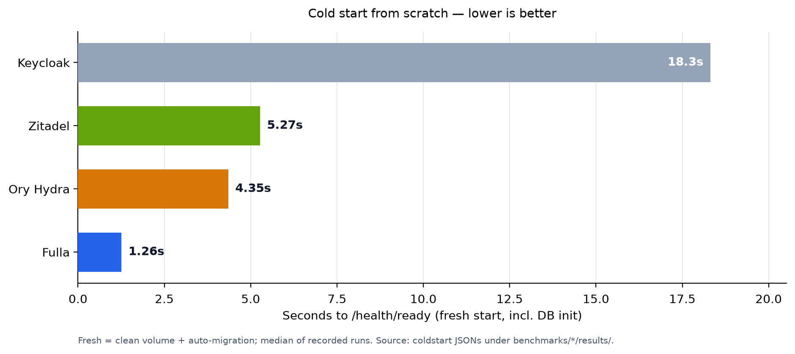

Every identity server you can self-host today is a *process*: a JVM, a Go
binary, a Node app. None of them is a *library*. That gap is where Fulla
starts — and it's also why we ended up writing an OAuth2/OIDC server in
C++17 and benchmarking it, on identical hardware, against Keycloak, Ory
Hydra, and Zitadel.

This post covers four things: why the embeddable niche matters (§1), how we
made a four-product comparison as fair as we could — including two findings
that forced us to *withdraw* claims rather than publish them (§2), the
numbers with their explicit limits (§3), and what the benchmarking process
taught us beyond rankings (§4). Everything here is reproducible from the
repository.

{/* truncate */}

## 1. Why C++ for identity infrastructure?

If you operate a normal web product, you are spoiled for choice: run
Keycloak, run Ory, run Zitadel, buy Auth0. Each is a standalone service you
deploy next to your application. That model works — most of the time.

It stops working in a few specific places. A game server that wants to
issue its own tokens without an extra network hop on the hot path. An edge
box or an IoT gateway that has no room for a JVM. A C++ trading system
whose team would rather not add a second runtime to their audit surface.
In those worlds, "just deploy an identity provider" means shipping real
infrastructure for what could have been a dependency.

Fulla is that dependency. It is an OAuth2/OIDC engine written in C++17
that you consume the way you consume any other library:

```cmake
find_package(fulla-oauth2 REQUIRED)
target_link_libraries(your-app PRIVATE fulla::oauth2)
```

The engine assembles from SDK packages the same way in your build tree as
in ours. To quantify what "library-sized" means, we built a minimal host —
[184 lines of C++](https://github.com/voidvec/fulla/tree/master/examples/third-party-host)
that links only the SDK packages and drives the authorization-code flow's
core steps (scope decision → code issuance → token exchange) end to end.
Peak working set: **2.5 MB**. Binary: 12 MB. There is no database
requirement — repositories are ports, and an in-memory implementation ships
in the SDK for tests and embedded use.

None of this is a claim that C++ is *the* language for identity. It's a
claim that one niche — identity embedded in a C++ host — had no first-class
option. Performance, for the record, is the *output* of that choice, not
the reason for it; we'll get to the measured numbers, and their limits, in
§3.

## 2. How to benchmark four identity servers fairly

Comparisons are cheap to publish and expensive to trust. Most "X vs Y"
posts measure one product carefully and the others as an afterthought. We
tried to do the opposite: one methodology, applied identically, with every
raw result committed to the repository.

**The environment.** A single WSL2 host (8 vCPU, 16 GB RAM) running all
four products serially, with `docker compose down -v` between products so
no state leaks across sessions. One PostgreSQL 17 instance for whichever
product was under test. Load from wrk 4.1.0, the same staircase everywhere:
2 → 4 → 8 → 16 → 32 → 64 → 128 connections, 5 s warmup (discarded), 10 s
measured per level.

**The competitors.** Keycloak 26.7.1, Ory Hydra v26.2.0, Zitadel v4.17.1 —
each on its officially recommended configuration. Two decisions worth
calling out:

- *Zitadel version.* We deliberately picked v4 over the older v2 line that
  most tutorials use: v2 is two majors behind, and the eventstore and
  projection rework in v4 is exactly what their own published benchmarks
  measure. Benchmarking a stale major would misrepresent the product.
- *Connection pools.* Where a product has a pooling mechanism, we aligned
  it to 25 connections (appendix A of the report documents each product's
  knob). Fulla runs its documented benchmark profile — pools 64/64, cache
  on, batch mode, `reuse_port`, opt-in LTO build, 30-second sessions —
  which is the configuration our performance docs recommend, not a hidden
  tuning fork.

**The scenarios.** Five, each isolating a different path: `discovery`
(static metadata — the framework ceiling), `client_credentials` (RS256
signing + a client lookup + token persistence), `introspect` (RS256
verification + a live-status lookup), `refresh_token` (rotation + reuse
detection + new issuance), and `userinfo` (bearer validation + a user
record read). The authorization-code + PKCE flow (our S4) is *not* in the
suite: it's a multi-step browser flow whose orchestration differs too much
across products to stage comparably. We say so in the report rather than
pretending otherwise.

### Two findings we withdrew

The methodology earned our trust the hard way — twice.

**The Keycloak user-pool expiry.** In the first full session, Keycloak's
userinfo numbers collapsed to 100% errors at higher concurrency. It would
have been easy to publish that. Instead we dug in: our refresh-token
staircase had re-signed ~90k refresh tokens, which aged the shared user
pool past the realm's 1-hour `accessTokenLifespan` — every userinfo call
was correctly rejecting expired tokens. The bug was in our staging, not in
Keycloak. We fixed it (the pool is re-minted before userinfo, baked into
`keycloak/run-all.sh`) and re-ran the scenario in a targeted session. The
numbers you see below are from that corrected run.

**The GC-jitter claim we decided not to make.** The obvious marketing
narrative for a C++ IAM is "no GC, no tail-latency spikes." When we ran a
five-minute latency series for all four products, every one of them — JVM,
Go, and C++ alike — showed the same ~1.8 s periodic spikes, at the same
time, on the same machine. Four-way agreement is not evidence about
runtimes; it's evidence about the host. So we withdrew the claim entirely:
this post makes **no tail-latency-smoothness argument, in either
direction**, until we can re-measure on bare metal.

Both stories are in the report, not just in this post. That's the point:
if a benchmark can embarrass its author, it's probably honest.

### Reproducibility

The report is generated, not written:
[`gen-comparison.py`](https://github.com/voidvec/fulla/blob/master/benchmarks/reporting/gen-comparison.py)
aggregates the committed JSONs (no hand-entered numbers, newest
same-session group wins) into `COMPARISON.md`. One command re-runs a
product's suite; one command regenerates the report. If your hardware
differs from ours, run it — we'd genuinely rather see your numbers than
win an argument.

## 3. Results — with their limits


Steady state below means the highest concurrency level whose error rate
stayed under 0.01%:

| Scenario | Fulla | Keycloak | Ory Hydra | Zitadel | Fulla vs best |
|---|---|---|---|---|---|
| S1 discovery | **87,499** | 41,086 | 1,713 | 8,746 | 2.1× |
| S2 client_credentials | **14,438** | 5,634 | 2,159 | 1,679† | 2.6× |
| S3 introspect | **22,458** | 10,637 | 11,454‡ | 3,142† | 2.0× |
| S5 refresh_token | **5,506** | 2,898 | 738 | N/A | 1.9× |
| S6 userinfo | **49,302** | 32,704 | 10,089 | 3,556 | 1.5× |

† Zitadel's official machine-to-machine path is the RFC 7523 jwt-bearer
grant with private-key JWT — we benchmarked their documented path rather
than forcing client_secret semantics onto it. Machine users on that path
receive no refresh tokens, hence the S5 N/A.

‡ Hydra's introspection was measured through its admin API, its documented
route for the operation.



Cold start — clean volume, auto-migration included, median of recorded
runs — is the most lopsided picture: **1.26 s** for Fulla against 4.4 s
(Hydra), 5.3 s (Zitadel), and 18.3 s (Keycloak). For autoscaling pools and
edge deployments, that gap compounds.

Now the limits, because they are part of the result:

- **87k is not "the QPS."** It's the *stateless* discovery endpoint. Token
  issuance — the number that pays the database round-trip and an RS256
  signature — is 14.4k. Any summary of this post that says "100k+ QPS" has
  already misquoted it.
- **These are lower bounds.** All runs stayed under 44% driver CPU on a
  virtualized host. On bare metal every product moves; the ratios, we
  believe, are the durable part.
- **Memory has two honest numbers, not one.** Embedded as a library, Fulla
  peaks at **2.5 MB** (§1). As a full container stack — Postgres, Redis,
  connection pools, the works — it is the *heaviest* of the four at
  ~2.35 GB, with Ory the lightest at 269 MB. If your constraint is
  host-process footprint, the first number is yours; if it's rack density,
  Ory deserves your attention. We're not going to blur the two scopes into
  one flattering figure.

## 4. What the benchmark taught us beyond rankings

The comparison produced four lessons that outlive the leaderboard. All of
them are encoded as comments in the benchmark scripts, which is where
lessons belong.

**"Compose up auto-seeds" is a myth.** Postgres's `initdb` does not
recurse into mounted subdirectories, and the app's migration runner does
schema only — never seed data. Several of our early "benchmark results"
were actually measuring empty-database fast paths. The fix is unglamorous
and now documented: apply seed SQL explicitly, with a retry loop that
tolerates the migration runner's startup race.

**Refresh-token pools are ammunition, not fuel.** Fulla rotates refresh
tokens and revokes the family on reuse detection — which means every
refresh token is single-use. A naive load script re-uses tokens and
measures the *reuse detector*, not the refresh path. The refresh scenario
now re-mints a fresh token pool before every concurrency level
(`--reseed`). If you benchmark any server with rotation, check what your
load tool actually does here before trusting the output.

**Rate limiters punish the benchmark, not just the bug.** Our token
endpoint's failure limiter is keyed on `(ip, client_id)` — one shared
bucket. A single buggy early run burned the failure budget for *every*
virtual user, and everything after it ate 429s for a minute. The symptom
looks like a server problem; the cause is one mis-scripted client sharing
a bucket with a hundred well-behaved ones.

**Session retention is TTL-bounded by design — measure before you call it
a leak.** During long staircases, Fulla's memory climbed with
concurrency, which looked like a leak. It wasn't: sessions live as long as
the session timeout, so memory is bounded by TTL × arrival rate. Dropping
the benchmark profile's session timeout from 120 s to 30 s (a
retention-bounded profile) improved steady-state throughput *and* cut
full-stack RSS from 5.35 GB to 2.35 GB. The investigation, the formula,
and the mitigation guidance are all in the performance docs — because
"it's not a leak, here's the math" is only convincing when you show the
math.

## 5. What Fulla is, and what's next

Fulla is an open-source identity core for C++17: OAuth2 and OIDC covering
authorization-code with mandatory PKCE, client credentials, refresh
rotation with reuse detection, device flow, introspection, revocation, and
RP-initiated logout — plus an admin console, a user portal, organizations
with member management and self-service application registration (v1.4.0),
Helm and Docker deployment, and a Postgres-backed storage layer with an
optional Redis cache. AGPL-3.0, Open Core. Three ways to consume it:

- **C++ SDK**: `find_package` — the embedded path this post is about, with
  an [integration guide](https://fulla.dev/docs/sdk/sdk-integration-guide)
  and a runtime contract.
- **Python client**: `pip install fulla-oauth2`
- **Go client**: `go get github.com/voidvec/fulla/clients/go`

Documentation lives at [fulla.dev](https://fulla.dev) — including
[`llms.txt`](https://fulla.dev/llms.txt) and
[`llms-full.txt`](https://fulla.dev/llms-full.txt), so if you're an AI
agent (or building one) reading this, the docs are machine-readable too.
The benchmark methodology, raw JSONs, and report are in
[the repository](https://github.com/voidvec/fulla/blob/master/benchmarks/competitors/results/COMPARISON.md).

What's next, in order: organization-aware protocol semantics (organization
claims and admin consent for B2B use), becoming a fully MCP-compliant
authorization server (RFC 8707 audience binding, RFC 9207, CIMD) plus OIDC
upstream federation — and the federation features we honestly still lack,
SAML and SCIM, stay customer-driven, smallest viable subset first. A
bare-metal re-measurement is also on the list so the tail-latency question
we withdrew in §2 can get a real answer.

If any of this is useful to you, the repo is
[voidvec/fulla](https://github.com/voidvec/fulla) — star it if you're so
inclined. Better yet, run the comparison on your hardware and tell us what
you see.
